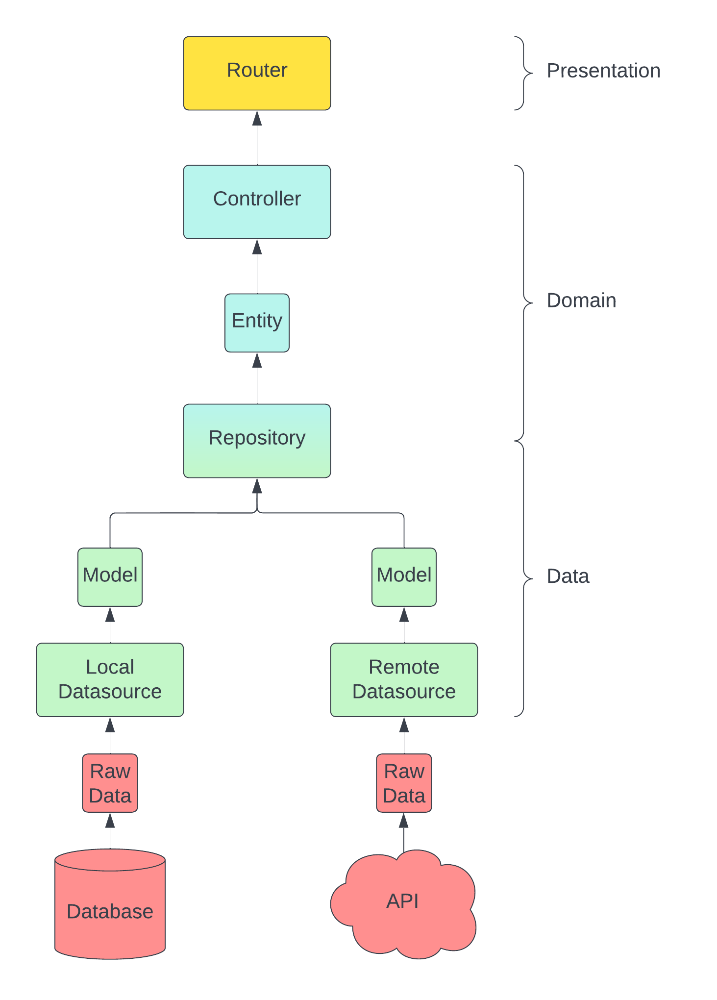

# Golang Clean architecture

This is an example to implement [Clean Architecture](https://blog.cleancoder.com/uncle-bob/2012/08/13/the-clean-architecture.html) in [Golang](https://go.dev)

Clean Architecture in this project was inspired by [Reso Coder's Flutter Clean Architecture Proposal](https://resocoder.com/2019/08/27/flutter-tdd-clean-architecture-course-1-explanation-project-structure/) and modified to be more appropriate with backend



## Run

```bash
git clone github.com/peam1146/go_clean_architecture

cd go_clean_architecture
```

change you config file in folder `config`

```bash
go mod download

go run src/main.go
```
## Tools
- [Golang](https://go.dev)
- [gofiber](https://github.com/gofiber/fiber)
- [sqlc](https://github.com/kyleconroy/sqlc)
- [viper](https://github.com/spf13/viper)
